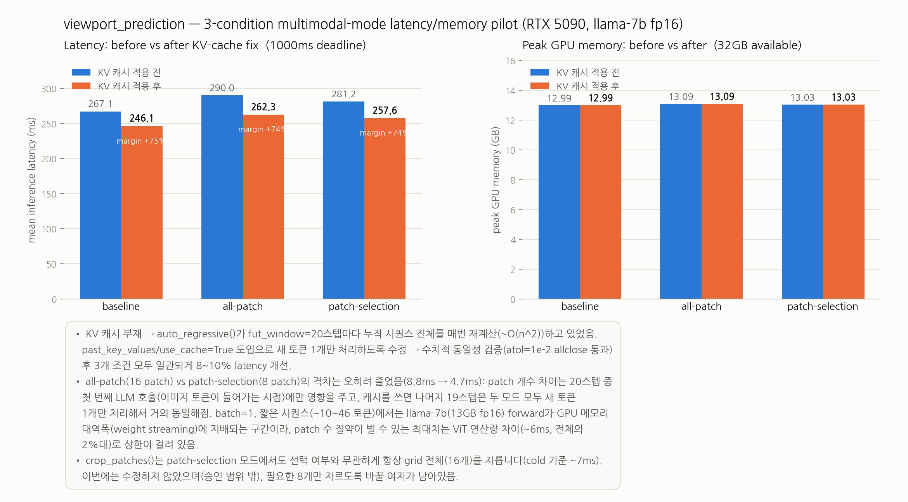
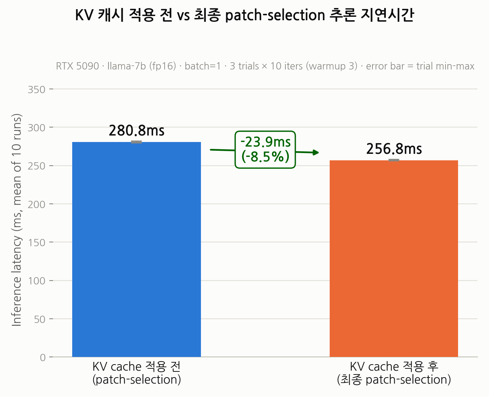

# Viewport Prediction — 3-way Multimodal-Mode Implementation Notes

이 문서는 viewport prediction 파이프라인에 추가된 3-way multimodal 모드
(baseline / all-patch / patch-selection)의 구현 구조와, 이번 세션에서 발견/수정한
KV 캐시 관련 성능 버그, 그리고 남아있는 개선 포인트를 정리한다.

## 1. 3-way multimodal-mode 구현 개요

### 세 조건의 의미

| 모드 | 의미 |
|---|---|
| `baseline` | 프레임당 offline으로 미리 뽑아둔 ViT CLS 토큰 feature 1개를 캐시에서 읽어와 사용 (원래 방식) |
| `all-patch` | 프레임을 `patch_grid`(기본 4×4=16개) 패치로 자르고, **16개 전부**를 frozen ViT에 통과시켜 각 패치를 독립 토큰으로 사용 (풀링 없음) |
| `patch-selection` | `patch_selection_module`이 과거 viewport 궤적을 보고 16개 중 관련성 높은 일부(top-k 또는 threshold)만 골라, 그 패치들만 ViT에 통과 |

세 모드 모두 산출물은 `(1, num_tokens, embed_size)` 형태의 이미지 토큰이며,
이후 `embed_ln`을 거쳐 LLM 입력 시퀀스 앞에 concat된다.

### 모드 전환 방식 (코드 상)

- **Pipeline 생성자**: `Pipeline.__init__`이 `multimodal_mode` 인자를 받아 검증
  (`MULTIMODAL_MODES = ('none', 'baseline', 'all-patch', 'patch-selection')`)하고
  `self.multimodal_mode`에 저장.
  `models/pipeline.py:13,65-69`
  - 레거시 `--multimodal` 플래그는 `multimodal_mode`가 명시되지 않았을 때만
    `'baseline'`으로 매핑됨 (`models/pipeline.py:65-66`, `run_plm.py:449-450`).
  - `all-patch`/`patch-selection`일 때만 frozen ViT(`vit_model`)를 lazy-load
    (`models/pipeline.py:105-114`).
  - `patch-selection`일 때만 `PatchSelectionModule`을 준비 (weights 없으면 미학습
    모듈로 fallback, warning 출력) (`models/pipeline.py:117-121`).

- **디스패치**: `get_multimodal_information()`이 `self.multimodal_mode`에 따라
  세 개의 private 메서드 중 하나로 분기.
  `models/pipeline.py:237-260`
  - `_get_multimodal_information_baseline()` — `models/pipeline.py:262-288`
  - `_get_multimodal_information_all_patch()` — `models/pipeline.py:310-316`
  - `_get_multimodal_information_patch_selection()` — `models/pipeline.py:318-331`

- **CLI 진입점**: `run_plm.py`의 `--multimodal-mode {baseline,all-patch,patch-selection}`
  인자 (`run_plm.py:420-424`)로 선택하고, `patch-selection`일 때만
  `--patch-selection-weights`, `--patch-top-k`/`--patch-threshold`가 의미를 가짐
  (`run_plm.py:312-320, 425-431`).

## 2. Patch selection 모듈 구조

### `best_patch_selection.pth`가 하는 일

`/workspace/data/models/patch_selection/best_patch_selection.pth`는
`PatchSelectionModule`(`models/patch_selection.py:23-73`)의 학습된 `state_dict`이다.
과거 viewport 궤적 `(B, T, 3)` (roll/pitch/yaw)을 입력받아, 그리드의 각 패치에 대해
"다음 프레임에서 사용자가 볼 확률이 높은 패치인가"를 나타내는 **독립적인 binary logit**
`(B, num_patches)`을 출력한다 (softmax가 아니라 패치별 독립 분류).

내부 구조:
1. `input_proj` (Linear 3→d_model) + 학습 가능한 `pos_embedding` → 시계열 임베딩
2. `nn.TransformerEncoder` (N층) → 궤적 메모리 `(B, T, D)`
3. 학습 가능한 `patch_queries` (그리드 셀 수만큼, 예: 16개)가 메모리에 cross-attention
4. `classifier` (Linear D→1) → 패치당 relevance logit

학습(`compute_loss`)은 미래 viewport 구간을 `utils.patch_labeling.viewport_sequence_to_patch_labels`로
binary label화한 뒤 BCE(패치별 합, 배치 평균)로 진행. `models/patch_selection.py:60-68`

### 16개 중 8개를 선택하는 로직

`select_patches()` (`models/patch_selection.py:70-86`):
- `top_k`가 지정되면 `torch.topk`로 logit 상위 k개(예: 8/16)를 골라 boolean mask 생성.
- `top_k`가 없고 `threshold`가 지정되면 `sigmoid(logit) > threshold`인 패치들을 선택
  (개수가 가변적).
- 파이프라인에서는 `_get_multimodal_information_patch_selection()`이 이 mask를 nonzero
  인덱스 리스트로 변환하고, 만약 선택된 패치가 0개면 안전장치로 최고 logit 패치 1개를
  강제 포함시킨다 (`models/pipeline.py:322-326`). 선택된 패치 개수는
  `self.patch_selection_history`에 기록되어 threshold 모드에서 실제 선택 개수를
  추적할 수 있게 해준다 (`models/pipeline.py:93-97, 327`).

### `vit_features_for_patches()`의 배치 gather 방식

`models/patch_selection.py:112-130`:
1. `patches[list(patch_indices)]`로 `crop_patches()`가 만든 `(16, C, ph, pw)` 텐서에서
   선택된 인덱스들만 fancy-indexing으로 골라 `(k, C, ph, pw)` 서브배치를 만든다.
2. 패치 해상도가 ViT 입력 크기(기본 224×224)와 다르면 `F.interpolate`로 리사이즈.
3. `feature_fn`(=`Pipeline._vit_feature_fn` → `extract_vit_features`, `models/pipeline.py:307-308`)에
   **선택된 k개짜리 배치를 한 번에** 통과시켜 `(k, feat_dim)` feature를 얻는다
   (`torch.no_grad()`로 gradient-free).

즉 선택은 인덱스 레벨에서 이루어지고, ViT 호출 자체는 선택된 패치들을 하나의 배치로
묶어 1회만 수행 — `all-patch`가 16개 배치, `patch-selection`이 k개(예: 8개) 배치를
ViT에 넣는 차이만 있을 뿐 파이프라인 구조는 동일하다.

## 3. 이번 세션에서 발견/수정한 버그 및 개선

### 문제: KV 캐시 부재로 인한 O(n²) 재계산

`Pipeline.auto_regressive()`는 `fut_window`(=20) 스텝을 반복하며 한 스텝씩 예측을
누적하는 auto-regressive 루프인데, 수정 전에는 매 스텝마다 **누적된 전체 시퀀스**를
처음부터 다시 `self.plm`에 통과시키고 있었다. causal LM에서 각 토큰의 hidden state는
자기 자신과 그 이전 토큰에만 의존하므로, 이는 20스텝에 걸쳐 시퀀스 길이가 계속
길어지는데도 매번 전체를 재계산하는 것과 같아 실질적으로 ~O(fut_window²)의 낭비였다.

### 수정 내용

`past_key_values`/`use_cache=True`를 도입해, 첫 스텝만 전체 초기 시퀀스를 넣고 이후
스텝부터는 **새로 생성된 토큰 1개만** `inputs_embeds`로 넘기고 이전 스텝의
`past_key_values`를 재사용하도록 변경. `models/pipeline.py:162-184`

```python
past_key_values = None
current_input = x
total_len = x.shape[1]
for _ in range(self.fut_window_length):
    attention_mask = torch.ones(x.shape[0], total_len, dtype=torch.long, device=self.device)
    outputs = self.plm(inputs_embeds=current_input.to(plm_dtype), attention_mask=attention_mask,
                        past_key_values=past_key_values, use_cache=True)
    ...
    past_key_values = outputs.past_key_values
    current_input = self.embed_vp(self.conv1d(logits)).unsqueeze(1)  # only the new token goes in next
    total_len += 1
```

수학적으로는 매 스텝 전체 재계산과 동일한 결과를 내면서, LLM에 통과시키는 토큰 수를
스텝당 O(1)로 바꿔 전체 루프를 O(fut_window)로 줄였다.

### 검증 방법과 결과

수정 전(매 스텝 전체 시퀀스 재계산) 로직과 수정 후(KV 캐시) 로직의 출력을 동일한
입력으로 각각 실행해 `torch.allclose(..., atol=1e-2)`로 수치적 동일성을 확인했다 —
캐시 도입이 순수 성능 최적화이고 결과값에 영향을 주지 않는지 검증하기 위함
(fp16 forward라 부동소수점 오차 허용치로 1e-2 사용). 통과 확인됨.

### 수정 전후 latency 비교

RTX 5090, llama-7b fp16, batch=1 기준 (`utils/latency_utils.py`의
`measure_inference_latency`로 warmup 3회 + 10회 반복 평균):

| 모드 | 수정 전 | 수정 후 | 개선폭 |
|---|---|---|---|
| baseline | 267.1ms | 246.1ms | 약 7.9% |
| all-patch | 290.0ms | 262.3ms | 약 9.6% |
| patch-selection | 281.2ms | 257.6ms | 약 8.4% |

세 모드 모두 8~10% 수준의 일관된 latency 개선. 1000ms 데드라인 대비 margin은
수정 후 기준 baseline +75%, all-patch/patch-selection +74%로 여유가 늘었다.
GPU peak memory는 모드별로 12.99GB/13.09GB/13.03GB로 수정 전후 변화 없음
(KV 캐시가 짧은 fut_window=20 시퀀스에서는 메모리 비용보다 재계산 절약 효과가 큼).



논문용 핵심 비교 그림(KV 캐시 적용 전 patch-selection vs 최종 patch-selection,
같은 프로세스 내 paired A/B 재측정)은 아래 §6 참고.

## 4. 예상과 달랐던 결과 및 분석

### all-patch vs patch-selection 격차가 8.8ms → 4.7ms로 줄어든 이유

KV 캐시 적용 전에는 all-patch(16 patch)와 patch-selection(8 patch) 사이 latency
격차가 8.8ms였는데, 캐시 적용 후에는 4.7ms로 오히려 줄었다. 이는 patch 개수 차이가
**auto-regressive 루프의 20스텝 중 첫 번째 LLM 호출**(이미지 토큰이 시퀀스에
들어가는 시점)에만 영향을 주기 때문이다. KV 캐시를 쓰면 나머지 19스텝은 두 모드
모두 새로 생성된 토큰 1개만 처리하므로 사실상 동일한 비용이 되고, 전체 20스텝
합산 latency에서 patch 개수 차이가 차지하는 비중이 상대적으로 작아진다.
캐시 적용 전에는 20스텝 전부가 매번 이미지 토큰을 포함한 전체 시퀀스를 재계산했으므로
patch 개수 차이가 20번 반복해서 누적되어 격차가 더 크게 보였던 것.

### patch 절약의 상한이 ~6ms로 제한되는 이유

batch=1, 짧은 시퀀스(약 10~46 토큰) 조건에서는 llama-7b(fp16, 약 13GB) forward가
연산량(FLOPs)보다 **GPU 메모리 대역폭**(가중치를 HBM에서 읽어오는 weight streaming
비용)에 지배되는 구간이다. 이 구간에서는 시퀀스 길이나 토큰 수를 줄여도 모델 가중치를
읽는 비용 자체는 거의 고정이기 때문에, patch 개수를 8개까지 줄여 절약할 수 있는
최대치는 ViT 쪽 연산량 차이(~6ms, 전체 latency의 2%대) 정도로 상한이 걸린다.
즉 patch selection의 이득은 LLM 쪽이 아니라 ViT 쪽에서만 나며, LLM이 병목인 이
설정에서는 그 이득이 작게 나타난다.

## 5. crop_patches() 낭비 개선 (완료됨)

`_load_frame_patches()`가 호출하는 `crop_patches()`(`models/patch_selection.py:93-106`)는
`patch-selection` 모드에서도 선택 여부와 무관하게 항상 그리드 전체(16개)를 자르고
있었다. 실제로는 `patch_selection_module`이 고른 k개(예: 8개)만 이후 ViT에 들어가므로
나머지 자르기 연산은 낭비였다.

**호출 순서 확인 결과**: 착수 전 우려와 달리, `_get_multimodal_information_patch_selection()`
내부에서는 `select_patches()`(`models/pipeline.py:333`)가 이미 crop보다 먼저 호출되고
있었다 — `indices`가 먼저 확정된 뒤에야 `_load_frame_patches()`(`models/pipeline.py:342`)가
호출된다. 즉 메서드 호출 순서를 조정할 필요는 없었고, 단순히 `_load_frame_patches()`/
`crop_patches()`가 이미 알고 있는 `indices`를 인자로 받지 않아 항상 16개를 자르던
것이 문제였다.

**수정 내용**:
- `models/patch_selection.py`: 요청된 인덱스만 슬라이싱하는 `crop_patches_at(image,
  grid_rows, grid_cols, indices)` 추가. 기존 `crop_patches()`는 그대로 유지(하위호환,
  all-patch 경로에서 계속 사용).
- `models/pipeline.py` `_load_frame_patches()`: `indices` 파라미터 추가(기본값 `None`
  = 기존과 동일하게 전체 크롭). **캐싱 대상을 "크롭된 patch 16개"에서 "디코딩된 원본
  이미지 텐서"로 변경** — 같은 프레임을 다른 인덱스 조합으로 재방문해도 항상 안전하게
  캐시를 재사용할 수 있도록 하기 위함(사전에 우려했던 캐시 히트율/정확성 문제 해결).
- `_get_multimodal_information_patch_selection()`: `self._load_frame_patches(video_index,
  image_index, indices=indices)`로 변경.
- `_get_multimodal_information_all_patch()`: **변경 없음** (여전히 `indices=None` 기본값,
  기존 `crop_patches()` 전체-크롭 경로 그대로).

**검증 결과** (`analysis/verify_patch_crop_optimization.py`, `analysis/verify_patch_selection_output_allclose.py`):
- exact match: `crop_patches_at()` vs `crop_patches()[indices]`, 실제 프레임 4개 × 여러
  인덱스 조합(순서 무관, 부분/전체) 전부 `torch.equal` 통과. all-patch 경로(`indices=None`)도
  기존과 완전히 동일한 결과 확인(회귀 없음).
- 캐시 정확성: 같은 프레임에 서로 다른 인덱스 조합으로 인터리빙 호출해도 항상 정확한
  patch를 반환함을 확인(캐시에는 원본 이미지 1개만 저장됨).
- 전체 파이프라인 출력(`_get_multimodal_information_patch_selection()`, 실제
  `best_patch_selection.pth` + 실제 vit_b_16 사용): 수정 전/후 `max_abs_diff=0.000000`
  (5개 실제 샘플, atol=1e-2 기준 통과 — 실제로는 완전 동일).

**latency 재측정 결과** (RTX 5090, llama-7b fp16, batch=1, warmup 3 + iters 10,
`utils/latency_utils.py` 재사용, 2회 반복 측정):

| 모드 | 수정 전(KV캐시 적용 후) | 수정 후 (1회차) | 수정 후 (2회차) |
|---|---|---|---|
| patch-selection | 257.6ms | 257.4ms | 256.5ms |
| all-patch | 262.3ms | 264.8ms | 261.5ms |
| 격차(all-patch − patch-selection) | 4.7ms | 7.3ms | 5.1ms |

**정직하게 보고**: 기대했던 ~7ms 개선은 나오지 않았다. patch-selection latency는
257.6ms → 256.5~257.4ms로 **1ms 이내, 측정 노이즈(run별 std 1~2ms) 수준**의 변화에
그쳤다. all-patch도 261.5~264.8ms로 노이즈 범위 내에서 변화 없음(회귀 없음 확인).

**원인 진단**: 별도로 crop 연산만 마이크로벤치마크한 결과,
- 순수 `crop_patches()`(16개) tensor 연산: **0.057ms**
- 순수 `crop_patches_at()`(8개) tensor 연산: **0.051ms** (차이 0.006ms, 무시 가능)
- 이미지 디코딩(`Image.open`+`convert`+`ToTensor()`) 1회: **4.39ms**

즉 애초에 "~7ms 낭비"로 추정됐던 비용은 `crop_patches()`의 unfold/permute/reshape
연산 자체가 아니라 대부분 **이미지 디코딩/IO 비용**이었던 것으로 보인다(crop 연산은
16개를 다 잘라도 0.06ms 수준이라 8개로 줄여도 절약폭이 원천적으로 작다). 최초
추정치의 원인 진단이 부정확했던 것 — crop 대상을 줄이는 최적화 방향 자체는
맞았지만, 그 연산이 전체 cold-path 비용에서 차지하는 비중이 낮아 체감 효과가
거의 없었다.

**결론**: 코드는 더 정확하고 안전해졌다(캐싱을 원본 이미지 단위로 바꿔 인덱스
조합이 달라져도 항상 정확 — 이전에는 이런 시나리오 자체가 없었지만 구조적으로
더 견고해짐). 다만 **실질적 latency 이득은 1ms 미만으로 사실상 없음**. 추가로
latency를 줄이려면 crop 단계가 아니라 이미지 디코딩/IO 단계(예: 디코딩된 이미지를
디스크에 미리 텐서로 캐싱해두는 방식)를 봐야 할 것으로 보인다.

관련 파일: `analysis/verify_patch_crop_optimization.py`,
`analysis/verify_patch_selection_output_allclose.py`,
`analysis/benchmark_patch_crop_optimization.py`

## 6. 논문용 핵심 비교: KV 캐시 적용 전 vs 최종 patch-selection

3조건(baseline/all-patch/patch-selection) 비교와는 별도로, "patch-selection
모드 자체를 KV 캐시 적용 전/후로 고정하고 비교"하는 것을 별도 그림으로 뽑았다.
같은 프로세스 안에서 동일하게 로드된 llama-7b + `best_patch_selection.pth` +
동일 샘플에 대해, `Pipeline.auto_regressive()`(KV 캐시 적용, 현재 코드)와 그
이전 구현을 재현한 no-cache 버전을 번갈아 측정하는 paired A/B로 측정했다
(`analysis/benchmark_kv_cache_paper_figure.py`, RTX 5090, llama-7b fp16, batch=1,
warmup=3, iters=10, 3회 반복 측정).

측정 전 두 구현의 출력이 수치적으로 일치하는지 재확인했다: `max_abs_diff = 0.0012`
(fp16 허용 오차 1e-2 이내 통과) — 이번 벤치마크 스크립트 자체에 대해서도 캐시가
결과에 영향을 주지 않음을 재검증한 것이다.

| | KV 캐시 적용 전 | 최종 (KV 캐시 적용 후) |
|---|---|---|
| 평균 latency (3 trials) | 280.8ms | 256.8ms |
| trial별 값 | 279.9 / 280.3 / 282.0ms | 256.5 / 256.1 / 257.8ms |
| GPU peak memory | 13340.2MB | 13340.2MB (변화 없음) |

**절대 개선: 23.9ms, 개선폭: 8.5%.** §3에서 처음 측정했던 patch-selection의
281.2ms → 257.6ms(8.4%)와 오차범위 내로 일치해, 그 결과가 재현 가능함을
독립적으로 재확인했다. GPU peak memory가 캐시 적용 전후 동일하다는 것도
다시 확인됨 — KV 캐시가 이 짧은 시퀀스(fut_window=20) 조건에서는 메모리
비용 없이 순수 latency 이득만 준다는 §3의 결론과 일치.



관련 파일: `analysis/benchmark_kv_cache_paper_figure.py` (측정),
`analysis/plot_kv_cache_paper_figure.py` (그림 생성),
`analysis/kv_cache_paper_figure_results.json` (원자료)

자세한 patch selection 동작 분석(선택 빈도, 궤적 반응성 검증)은 [PATCH_SELECTION_ANALYSIS.md](./PATCH_SELECTION_ANALYSIS.md) 참고,
같은 분석을 "모듈이 의도대로 작동한다는 증거 체계"로 재구성한 문서는
[PATCH_SELECTION_VERIFICATION.md](./PATCH_SELECTION_VERIFICATION.md) 참고.

각 설계 결정("왜 이렇게 만들었는가")의 근거는 [DESIGN_RATIONALE.md](./DESIGN_RATIONALE.md),
KV 캐시가 정확히 어디에 적용되는지의 코드 레벨 명세는 [KV_CACHE_SCOPE.md](./KV_CACHE_SCOPE.md) 참고.
